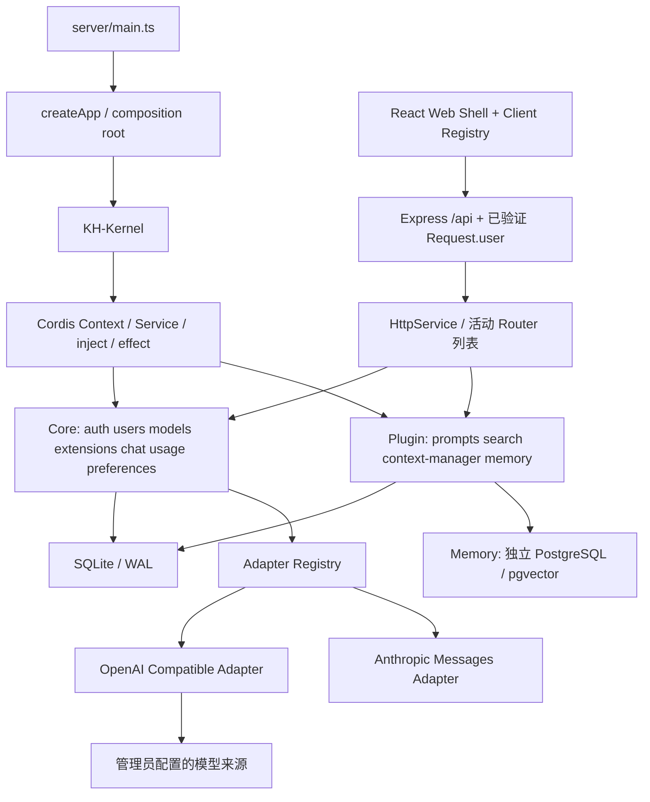

# KH-Kernel 架构

本文描述当前实现与需要保留的边界。入门阅读顺序见 [开发指南](DEVELOPMENT.md)，新增功能见 [FEATURES.md](FEATURES.md)，组件与视觉契约见 [UI_GUIDE.md](UI_GUIDE.md)。名称区分：Drift Space 是产品，KAKAM-Harness 是仓库，KH-Kernel 是平台层；Cordis 是被嵌入的库。

## 分层



**Cordis engine** 提供 Context、服务依赖注入和生命周期。**KH-Kernel** 管理本应用的 feature catalog、启动验证、核心能力保护、启停状态持久化。**Adapter** 隔离供应商模型协议。没有 fork 或重写 Cordis。

Cordis 固定在 `3.18.1` 稳定版；不依赖 `latest` 的候选版本。启动等待生命周期任务完成，注册失败时拒绝启动。

## 装配和运行路径

服务端入口 [`server/main.ts`](../src/server/main.ts) 读取配置并调用 `createApp(config)`。后者创建 Kernel，按 auth → users → models → extensions → llm-production → search → chat → usage → prompts → preferences → context-manager → memory 注册，再启动 Context。Kernel 先安装 Database、HttpService、AdapterRegistry 和 OpenAI 兼容、Anthropic Messages、Jev Adapter。新增 feature 需要显式导入和 `kernel.register()`，没有目录自动发现。

每个请求先经过全局 HTTP / Origin / JSON 校验，再从 Cookie 解析 `req.user`，最后进入活动 Router。Kernel 负责装配与启停，并不是每个业务 HTTP 请求都调用一次的分发器。`HttpService.register()` 返回移除 Router 的函数；它是路由卸载能立即生效的关键。

客户端入口 [`client/main.tsx`](../src/client/main.tsx) 创建 UiProvider 和 App。App 解析 hash 路由、加载当前用户、获取服务器 feature 状态；编译期 `clientFeatures` 与运行时目录取交集，决定可见组件。UI 隐藏不代表后端已经鉴权，后端仍独立执行权限与归属校验。

| Feature ID        | kind   | 提供的能力                                                             | 主要 UI 位置                         |
| ----------------- | ------ | ---------------------------------------------------------------------- | ------------------------------------ |
| `auth`            | core   | AuthService、邮箱注册 / 登录、账户资料、个人头像                       | 登录页 / 设置中的账户设置            |
| `users`           | core   | 管理用户、角色、停用、重置与会话撤销                                   | 管理员设置                           |
| `models`          | core   | ModelsService、来源、白名单、模型授权、连通性测试                      | 管理员设置；聊天可见已授权模型       |
| `extensions`      | core   | 托管能力注册、Auto 决策、辅助模型用量                                  | 管理员设置；聊天能力开关             |
| `search`          | plugin | Perplexity 搜索、查询生成与来源记录                                    | 拓展能力的子设置页                   |
| `llm-production`  | core   | ProductionService、文件 / 图片生成、私有空间、下载与清理               | 聊天右上角 / 工作区 / 设置           |
| `chat`            | core   | 私有对话与分组、后台生成、SSE 订阅与停止                               | 工作区                               |
| `usage`           | core   | 真实用量记录、汇总与活动数据                                           | 统计                                 |
| `preferences`     | core   | 明暗模式、Color Pattern、Chatbot 头像                                  | 通用设置                             |
| `prompts`         | plugin | Skill 管理、版本与参考文件、简介模型、聊天载入                         | 工作区                               |
| `context-manager` | plugin | 历史压缩、上下文快照、节点摘要与 LLM hand-off                          | 回复抽屉 / 设置                      |
| `memory`          | plugin | 三层记忆、pgvector 召回、LLM 抽取 / Remember、长期纳入、策略配置和 API | 工作区与设置；上下文抽屉展示实际注入 |

Models 的管理页受管理员限制，但已授权模型列表 API 向普通用户开放；不能把整个 models feature 的 HTTP 接口统一锁成管理员专用。Core / Plugin 是生命周期分类，`adminOnly` 是目录可见性，两者不是同一个维度。

## 关键边界

- `Context` 是共享能力，不放 `currentUser`。每个 HTTP 请求通过 HttpOnly Cookie 解析出自己的 `Request.user`；跨 feature 服务显式接收 `User` 参数。
- `models` 是白名单。探测到的供应商模型不会自动启用；管理员明确创建白名单条目。来源 `providers` 与模型 `models` 分表，授权 `model_grants` 以 `(model_id,user_id)` 为复合主键。
- `ModelsService.authorize(user, modelId)` 在每次模型调用前检查白名单、enabled 和授权。管理员也不能调用停用的模型。撤销权限对下一次请求生效，已在执行的请求可完成或由用户停止。
- 所有会话操作同时检查 `conversation.id + user.id`。管理员可管理用户及全局统计，但会话 API 不提供读取其他用户对话的旁路。
- 用量在请求开始时落库为 `streaming`，结束时记录实际 usage 和状态。取消 / 异常时保留已上报用量，未上报的 tokens 为 NULL。重启将遗留的 streaming 消息与用量标为 error。
- 图片经格式、MIME、数量、大小检查，以 data URL 随消息存入 SQLite，发送给被选择的模型来源；不通过公共静态 URL 暴露。

## 生命周期

每个服务端 feature 声明 `inject`。其 Router 用 `ctx.effect(() => ctx.http.register(router))` 注册，注册函数返回 disposer。插件停用时 Cordis 释放作用域，Router 同步从活动列表撤销。插件自己的数据不会自动删除。

服务端 `/api/features` 返回已验证用户可见的 manifest 与 enabled 状态；前端把它和编译期 client catalog 取交集生成导航、路由。Client catalog 的 placement 描述 workspace / statistics / settings 展示位置；设置容器属于 Web Shell，feature 保留各自 server/client 实现。工作区 feature 可通过同一 client 注册的 `settingsComponent` 提供独立设置页，沿用 manifest 权限与启停过滤。管理员更新插件后立即刷新，其他客户端每 30 秒刷新目录。禁用后旧标签页可能短暂保留 UI，但 API 即刻不可用。

Core 和可选插件都按 feature 组织；“core”指平台启动必须具备且不允许在 UI 停用的 feature，区别于 Cordis 引擎自身。

注册与启停通过 Kernel 的 promise 链串行化，重复启用不会重复装配作用域。`settings` 保留启停状态，新插件无历史记录时启用；停用不删除数据，也不从前端 bundle 删除代码。没有沙箱隔离，只有可信的构建期模块与可释放的运行作用域。

## 安全与持久化

- 密码以随机盐 + scrypt 哈希保存。首位用户通过公开注册创建，角色判断与插入在同一 SQLite 写事务内完成，避免并发产生多位初始管理员。后续注册忽略客户端角色，强制普通用户。
- 密码只要求非空，不设置位数或字符组合策略；注册、登录、账户修改、管理员重置使用同一规则。
- 新用户提供 email / displayName / password；邮箱去掉首尾空白并转小写，以大小写无关唯一索引保证不重复，显示名称不作为身份标识。`users.email` 追加迁移允许旧账户暂为 NULL；旧 username 仅用于凭原密码绑定邮箱，不伪造地址或修改原用户 ID。更改邮箱需要当前密码并撤销其他会话，管理员变更邮箱会撤销该用户会话。
- Session 使用随机 256-bit token，数据库只保存 SHA-256 摘要；HttpOnly + SameSite=Strict Cookie，7 天过期。停用 / 改角色 / 管理员重置密码会撤销对应账户 session。
- API Key 使用 AES-256-GCM 加密，密钥从 `APP_SECRET` 派生。查询响应仅返回 `hasKey`，错误不反射上游凭据。管理员主动连通性测试可接收经脱敏且限长的输入 / 输出 / 错误诊断，只存在本次响应，不写数据库；普通模型调用不启用捕获。诊断契约见 [功能指南](FEATURES.md#来源探测与模型连通性测试)。
- 修改 API 要求 JSON 与匹配 Origin（浏览器请求）。登录限速、CSP、HTML 非执行渲染、Mermaid strict 模式作为补充。
- `providers.api_mode` 追加迁移默认 `chat-completions`。`ModelsService.adapter(apiMode)` 将 Chat Completions / Responses 路由到 OpenAI 兼容 Adapter，将 `anthropic-messages` 路由到独立 Anthropic Adapter；探测、测试和聊天必须统一使用此映射。思考字段只在非 none 时发送。`ui_preferences` 以 user_id 隔离主题和头像。
- 来源地址只允许管理员配置 HTTP(S)，默认不跟随重定向。支持内网模型是预期能力，因此没有阻止管理员选择私网地址。插件与管理员都属于可信边界，不能用它作为不可信租户任意网络访问的平台。
- SQLite WAL、外键和关键索引；涉及模型授权或聊天 / 用量的关联写入使用事务。未来扩容多实例时需迁移存储和生成锁。

### 模型顺序、来源元数据与回复用量

- `providers.platform_url` 为可空的平台链接，仅 HTTP(S) 且不含嵌入凭据。只出现在管理员 DTO，API 连接仍只使用 baseUrl / key / apiMode。更新时省略该字段保留旧值，空字符串或 null 清空。
- `models.sort_order` 为全局顺序。首次升级按旧的来源名称 / 模型名称排序初始化；后续启动不重排。新模型使用 MAX + 1 追加，列表按 sort_order、id 稳定排序。
- `PATCH /admin/models/order` 接收 `{ modelIds: string[] }`，管理员校验后在同步事务中验证为现有全部模型 ID 的无重复排列，再保存索引。列表增删造成冲突返回 409，不部分保存。停用模型可排序但不参与默认选择；普通用户过滤授权后第一个 LLM 为其聊天默认。Embedding / Jev / Image 不参与聊天默认选择。浏览器已明确选择且仍有权限的模型继续优先。
- `requestId = messages.id`（assistant），首个回答模型请求沿用该 ID 记入 usage，后续工具循环请求使用独立 ID。`messages.calls` 保存调用关联；历史按 usage 中的实际记录聚合，旧消息仍 LEFT JOIN 原用量。任一调用缺失上报时完整合计为 null，`Message.usage` 为 `{ input, output, total } | null`；用户消息不带此字段。最终 SSE `done.message` 也带相同值，重连 snapshot 与历史一致。查询用量前仍先校验对话所有权；此关联不会让管理员读到其他用户的私人回复。
- `messages.duration_ms` 是可空非负整数，追加迁移保留旧数据为 null。聊天任务用服务器单调时钟从后台任务开始到结束计时，包含拓展调用、上游等待与生成；完成、失败和主动停止都持久保存。`Message.durationMs` 在 SSE done、历史与重连 snapshot 中一致，浏览器离开或幂等重试不会重置。旧消息及异常进程退出前未记录的用时不推算。
- Anthropic 原生头为 x-api-key / anthropic-version，图片转为 base64 内容块；只向聊天正文转发 text_delta，忽略 thinking/signature 内容。message_start 与 message_delta 的 usage 按字段合并，输出为累计计数。输入加上 cache creation / cache read，message_stop 才代表协议结束；缺失结束、error、max_tokens 等保留已生成文本并报告未完成。None 不发送思考字段；非 None 使用 adaptive + output_config.effort，兼容范围和输出上限见 README。

### 数据归属

| 数据                           | 当前持久化位置                                               | 边界                                                           |
| ------------------------------ | ------------------------------------------------------------ | -------------------------------------------------------------- |
| 账户 / 头像 / 会话             | `users`、`sessions`                                          | 会话只存 token 摘要，客户端持有原 token                        |
| 来源 / 模型 / 授权             | `providers`、`models`、`model_grants`                        | API Key 密文的解密依赖 `.env` 中的 APP_SECRET                  |
| 对话 / 消息 / 图片             | `conversations`、`conversation_groups`、`messages`           | 图片随消息保存在数据库，访问检查用户归属                       |
| 用量                           | `usage`                                                      | 用户查看自己，管理员查看全局；没有真实 usage 就保留 NULL       |
| 插件启停 / Skill               | `settings`、`skills`、`skill_versions`、`prompt_preferences` | 停用保留数据，重启恢复启停状态                                 |
| 三层记忆 / 向量 / 策略配置     | 独立 PostgreSQL 的 memory_* 表                               | namespace + owner 隔离；备份需配套 pg_dump                     |
| 上下文快照 / 交接模型偏好      | `context_snapshots`、`context_preferences`                   | 按账户与对话隔离，编辑 / 重试保留快照，删除对话级联清理        |
| 明暗模式 / 色系 / Chatbot 头像 | `ui_preferences`                                             | 以 user_id 隔离；浏览器有外观缓存，服务器是账户持久化来源      |
| 字号                           | localStorage `drift:font-size:<userId>`                      | 按账户和当前浏览器保存，不随服务器备份迁移                     |
| 最近模型 / 思考程度            | `kh:model` / `drift:effort:<userId>:<modelId>`               | 最近模型是浏览器级偏好，实际使用仍受用户模型列表和后端授权约束 |

平台 SQLite 表结构和追加迁移集中在 [`kernel/database.ts`](../src/kernel/database.ts)。其事务回调同步执行，不能把 async 函数 / await 放入其中；网络 I/O 应在事务外完成。Memory 独立 PostgreSQL 表由 [`kernel/memory-database.ts`](../src/kernel/memory-database.ts) 在插件初始化时集中迁移，允许异步数据库事务，但模型 / 网络请求仍不能放入事务。两种数据库之间没有跨库外键或分布式事务。未来改变持久化格式时要兼容已有数据，具体扩展步骤见功能指南。

产物每账户容量默认 1 GiB，全局管理员配置保存在现有 `settings` 表的 `llm-production:storage`。ProductionService 在容量查询、预检和写入时读取配置；缩小额度不删除已有文件。文件仍按 owner 隔离，管理员容量接口不提供其他用户的文件访问；配置与数据一起备份，详见 [产物契约](LLM_PRODUCTION.md#空间与保留时间)。

`PUBLIC_ORIGIN` 目前只接受一个来源，比较浏览器发送的 Origin。`COOKIE_SECURE` 控制会话 Cookie 的 HTTPS 限制；`TRUST_PROXY` 控制 Express 对代理的信任，不是绕过 Origin 校验的开关。部署配置、数据库和密钥的备份规则见 [README](../README.md#备份与重新构建)。

## 取舍

第一版优先支持个人部署的闭环，未引入工作区租户、跨机器事件总线、沙箱或通用任务编排。Memory 已通过 extensions 的稳定注册契约接入；之后增加其他 RAG 能力也不能让基础聊天强依赖某个可选插件。

参考：[Cordis 官方仓库](https://github.com/cordiverse/cordis)。本仓库的实际行为以锁定版本、实现和集成测试为准。

## 三层记忆与独立存储

`memory` 插件提供 Memory Manager，并向 `extensions` 注册唯一可撤销的 MemoryProvider。Chat 在回答前准备记忆，将返回块以用户级参考文本合并到本轮输入；回答完成并保存后异步抽取，失败不会改写已完成回复。插件停用移除 API 与 provider、取消自己的辅助任务，保留 PostgreSQL 数据；SSE 订阅卸载不取消服务器任务。服务重启不续跑抽取和索引任务，遗留操作标为中断后由用户重试。

SQLite 继续保存账户、原始聊天、来源、模型、授权、真实用量和 context 快照；独立 PostgreSQL/pgvector 保存记忆、来源证据、历史版本、候选、长期纳入状态与时间、作用域状态、优先 / 排除、用户偏好、策略配置、向量空间及操作记录。Remember 预览也存于用户私有操作记录，在确认前不创建记忆。连接来自 `MEMORY_DATABASE_URL`，`MEMORY_NAMESPACE` 是部署级隔离标识；所有私有查询同时限定 namespace 和 owner。外部聊天 / 用户 / 分组 ID 不建立跨数据库外键，不能声称具有分布式事务。

迁移集中在 `kernel/memory-database.ts`，插件初始化时获取数据库 / schema 范围的 advisory lock 并追加业务表版本；请求不改 schema。管理员预建专属 schema、配置角色搜索路径并在 public 安装 pgvector，应用不会安装扩展或覆盖搜索路径。共享接入检查受限应用角色及 schema / 表所有权，默认连接池上限 5；初始化失败或断线后后台退避恢复。独立 `memory-db` CLI 提供迁移和只读检查，`/api/health/memory` 报告数据库就绪，平台存活检查保持独立。连接未配置或失败时聊天跳过记忆，连接串与底层错误不返回客户端。详细配置与部署见 [Memory 数据库接入](MEMORY_DATABASE.md)。

作用域为 `user`（长期）、`group`（同一用户指定分组）和 `session`（持久化 conversationId）。默认个人开关关闭，配置并启用后使用 default 策略。长期记忆默认无限保留；分组 / Session 由最近活动和用户保留设置清理，显式 expiresAt 仍有效。召回的 recentDays 是偏好，不是删除期限。

default 策略先 embedding 查询并执行 pgvector 精确余弦检索，再由 LLM + Prompt 返回候选 ID 和理由；Manager 校验范围、有效状态、版本、选择项和最终预算后读取保存正文。初始候选 36、相似度 0.3、最终最多 12 条 / 6000 UTF-8 字节、三个作用域各 4 条、总时限 15 秒。LLM 失败按配置降级向量结果或跳过；embedding / 数据库失败不阻止回答。没有 Redis、HNSW、自动语义冲突替换或原聊天压缩。

Embedding 是模型级类型，同一供应商可接入 LLM 与 embedding。`ModelsService.embed` 逐调用授权并记录每个真实 usage 字段，缺失值为 NULL；来源、模型配置指纹和维度共同决定向量空间。修改模型、来源或维度后不能直接把新向量与旧空间混查；重建成功后切换，新旧空间隔离。索引以正文版本校验，迟到 embedding 不覆盖已编辑记录。

记忆策略是可信构建期模块，服务端泛型策略与客户端专属设置面板双注册。策略得到已限定的候选和工具，不得到数据库连接、凭据或任意 owner。用户公共设置决定每类 `off / confirm / auto` 写入，默认长期确认、分组 / Session 自动；长期 auto、手动创建和 Remember 确认只能 pending，用户在管理页显式纳入才 active 并记录 admittedAt。模型不能批准或纳入自己的草稿。修改长期正文或撤出后回到 pending，不参与召回；历史 active 数据保持有效且未知纳入时间为 null。分组自动记忆只能属于对话的实际本人分组。

Remember it 是用户对已完成回复发起的独立辅助调用：读取保存的问答 → 授权抽取 LLM 总结并提出助手原文 evidence → 持久预览 → 用户选择当前分组 / 长期并确认。确认前再次校验原文哈希、消息状态和分组，不修改原聊天。来源回溯只返回本人哈希一致的片段；changed / unavailable 不泄露修改后的或他人的内容。该流程与自动策略抽取、Context Manager 压缩 / 轨迹摘要分别存储。接口和后续 Agent 扩展详见 [Memory API](MEMORY_API.md) 与 [策略开发指南](MEMORY_AGENTS.md)。

## 界面偏好

界面偏好由 preferences feature 保存到用户独立的 `ui_preferences`。v0.6 的追加迁移新增 `color_pattern`，从旧 `accent_color` 推导所属色系；后者仅保留旧客户端兼容。Web Shell 使用独立的 `shellTokens(mode)`：纯黑白灰的表面、文字与控件，不受色系切换影响。`conversation_groups.color_slot`、`skills.color_slot` 以可空整数保存手动选色，null 代表稳定自动配色；更新 API 校验范围和资源所有权。切换色系以序号映射，短色板按模数折返，不删除历史选择。

代码语法颜色独立存放在 `syntax-highlighting.css`，按相同的语义 token 集合分别提供明暗色板（基于 highlight.js GitHub 主题），仅作用于 Markdown 代码块。不要用 Shell 文字色覆盖 `.hljs-*`；浏览器回归测试会在不重建消息 DOM 的情况下切换系统主题，检查 Python 关键字、函数名、数字、字符串、内置函数、注释的区分与可读性。

个人头像由 auth feature 的 `PATCH /auth/avatar` 管理，服务端只更新当前会话账户。`users.avatar` 追加可空列，统一 User 响应包含头像；客户端居中裁剪为最长 512 px 的方形栅格，服务端再次校验图片签名与 512 KB 上限，不接受 SVG、外链或目标用户 ID。通用 `UserAvatar` 在加载失败时回退到姓名首字。

色系注册接口可配置 `tint.light` / `tint.dark` 的 fill、soft、line 不透明度，统一映射组件底色、淡底色和边框；仍保留次要文字对比度保护。

## 私人对话分组

分组属于 chat 核心能力。`conversation_groups` 保存 `id`、`user_id`、名称、图标 / emoji、可空 `color_slot` 和创建时间；`conversations.group_id` 通过追加迁移加入，旧对话默认为 NULL。外键采用 `ON DELETE SET NULL`，删除分组不删除消息、不影响后台生成。原有 `conversations.color_slot` 数据和 PATCH 输入仅用于兼容旧客户端，当前 UI 不应用该颜色。

分组列表、修改和删除都限定当前 `req.user.id`；将对话移入分组或在组内新建时，同时校验对话与目标分组归属，跨用户资源返回 404。所有修改只在输入和归属校验后写入，组合修改使用同步事务。分组按创建顺序，组内对话按最近更新时间；列表返回当前用户所有对话，避免以前的 300 条截断让分组内旧对话不可见。暂不分页、嵌套、共享或拖拽排序。

Shell 的现有 refresh 同时读取分组与对话，并在账户变化后丢弃旧账户响应；退出和重新登录清空分组与搜索，列表组件按账户 key 重建。折叠状态仅在本次页面会话中保留。完整 API 见 [功能扩展](FEATURES.md#对话分组-api)。

## 实时输入

聊天 feature 内的 Tiptap 编辑器持有富文本树，只有外部草稿变更才重载内容；编辑时使用事务保留光标、选择和撤销历史。粘贴 Markdown 会解析为文档，发送仍保存 Markdown，沿用服务端消息契约。公式通过 KaTeX 节点显示并提供编辑弹窗，代码块保留可编辑源码及 Mermaid / LaTeX 预览。中文输入法合成期间 Enter 不触发发送。

模型与思考程度由聊天 feature 的 `ModelPicker` 统一提供，原生 Popover 进入顶层以避免被聊天容器裁切，随窗口 / 可视视口调整位置。模型列表可搜索，五档滑块保留键盘操作；选择仍由 ChatPage 保存并写入原消息请求协议，None 继续省略上游思考字段。

## 生成任务与浏览器订阅

`POST /conversations/:id/messages` 事务保存用户消息、streaming 回复和用量记录后返回 202，后台任务持有上游请求的 AbortController。提交 UUID 同时作为回复 ID，重试相同提交仅返回原任务，防止重复调用。

修改最后一次提问、重试失败 / 已停止回复，或对已完成的最后一条回复再次生成时，提交相同路由并附 `replaceLastMessageId`（最后一个 user 消息 UUID）和新的 `requestId`；可指定另一个已授权的 LLM 与思考程度。服务端要求最近两条恰为该 user 与已结束的 assistant，且对话归当前用户；事务中更新提问、替换末条回复并新建生成任务。旧回答的用量记录独立保留在统计中，续接上下文排除被替换的问答。传回同一 `requestId` 仍只确认原任务。

活动任务按 conversationId 保存，每个对话最多一个；另以 userId → Set<conversationId> 记录用户额度。`MAX_CONCURRENT_CHATS` 默认 5，可配置 1–20，管理员与普通用户均遵守同一上限，不限制其他用户的额度。额度仅计算活动聊天回复，不合并独立辅助任务；满额或同一对话重复生成返回 409，不追加消息或用量记录，不自动排队。相同 requestId 的幂等确认先于额度检查，满额仍可确认已接受的任务。完成、失败、停止均在 finally 释放该对话及对应用户名额；停止 API 只取消目标对话，取消结束前仍占名额。

`GET /conversations/:id/events` 是可替换的 SSE 订阅：先发送完整 snapshot，再发送带 messageId 的 delta 和最终 done。活动任务保留最新文本并每 1.5 秒写入检查点，结束时提交完整回复与用量。订阅断开仅清理监听器和心跳，不中止上游。所有订阅、查询和停止操作均校验会话归属。

前端在可见性恢复、focus、pageshow 或 online 时重新订阅；连接错误时退避重试。snapshot 替换本地消息，避免重连重复追加文字。客户端卸载、隐藏或离线仅销毁订阅，不发送停止请求；`POST /conversations/:id/stop` 才显式取消当前生成。列表已有活动回复时，可见页面每 3 秒仅刷新对话列表，同步后台对话的生成标记；无活动回复后恢复原有 30 秒刷新。

KH-Kernel 的 shutdown hook 在 Cordis 关闭数据库前取消并等待活动任务保存结束状态。异常重启则将遗留 streaming 记录标记 error。生成任务现在按进度刷新 5 分钟空闲时限，且有 15 分钟总时限；正常长流不会在 180 秒被切断。失败原因写入 `messages.error`，历史和重连均显示同一安全提示。该实现不跨进程恢复上游生成，仍为单进程后台任务。

## 字号与聊天阅读位置

字体大小属于当前设备的账户偏好，独立于服务端 `UiPreferences`。Web Shell 的 UiProvider 在账户切换时加载 `drift:font-size:<userId>`，退出时恢复默认，并同步同设备标签页的 storage 事件。`typography.css` 用固定 rem 根字号定义语义字号和统一缩放系数，组件引用变量；正文、输入、控件、代码、辅助说明与标题保留层级。设备未允许存储时仍即时应用，并在设置页提示无法持久保存。

聊天 feature 使用独立的 `.chat-history` 滚动容器，输入框在其下方自然占位。阅读位置 hook 区分底部跟随、用户上翻及问题跳转，ResizeObserver 覆盖流式增长、图片 / 图表异步排版及字号导致的高度变化。订阅更新保留现有历史，避免加载状态清空 DOM 导致位置跳动。大纲使用消息 ID 定位，内容作为纯文本摘要呈现，不插入模型生成的 HTML。

## Color Pattern 扩展接口

共享模块 `src/shared/appearance.ts` 定义 `ColorPattern`、`ColorAssignment` 与 `ColorPatternRegistry`。只在这个注册表添加色系，前端标签页、选色器和后端校验就能同时识别：

```ts
colorPatterns.register({
  id: 'coast',
  name: '海岸',
  description: '海水与沙滩的颜色',
  colors: [
    { id: 'sea', name: '海蓝', original: 'Sea', color: '#427b98' },
    { id: 'sand', name: '沙金', original: 'Sand', color: '#c7aa7e' },
  ],
});
```

Registry 校验唯一 ID、1–64 色、合法六位十六进制值；每个色系可以拥有不同长度。`resolve(patternId, mode, { key, slot?, index? })` 将色板映射为原色、组件背景、柔和背景、边框和中性文字 CSS token，并调节背景混色保证辅助文字达到 4.5:1 对比度。`slot` 为手动序号；省略时由稳定 key 和 index 分配。不得在 render 中使用 Math.random，以免刷新、流式更新时跳色。

Feature 的 React client 使用公共 hook 和样式：

```tsx
const colors = usePatternColors();
<article
  className="panel pattern-card"
  style={colors.style({ key: item.id, slot: item.colorSlot })}
>
  <h3>{item.title}</h3>
</article>;
```

对话分组、Skill 库、统计卡片和活动图均复用映射；空白对话首页只保留问候语与输入框。文本始终继承 Shell 的中性文字，原色色值用于边框、图标、色样与数据可视化。`ColorPickerButton` 提供共用选择弹窗，持久化由各 feature 的授权 API 完成。主题和色系随账户保存，字号继续保持设备独立。

## LLM 拓展能力核心

`ExtensionsService` 是聊天与能力插件之间唯一的运行入口。chat 注入 extensions，在最终回答前调用 `plan()` / `prepare()`；Search 只向核心注册 `ExtensionDefinition`，不依赖 chat、不挂聊天路由。注册使用 Cordis `ctx.effect`，卸载撤销条目并中止正在执行的该插件调用。没有选中能力（默认 Off）时直接返回原上下文，不增加模型或搜索调用。

`settings` 的 `extension:<id>` 保存管理员能力策略（enabled、strategy、llmModelId、decisionModelId）；`search:config` 保存检索配置，密钥用 ModelsService 的同一 SecretVault / APP_SECRET 加密。管理列表默认模式与聊天拓展菜单共用 `extension_preferences`，按 user_id 保存，不是覆盖所有用户的全局开关；单项修改仅合并对应能力，跨标签页通过 BroadcastChannel 通知刷新，账户切换隔离结果；聊天请求携带模式快照，后续修改不改变已提交任务。停用保留配置，重新启用重新注册一次。模式语义与使用方法见 [README](../README.md#搜索与自动决策)。

辅助 LLM 默认跟随本轮聊天模型，也可引用模型管理中的指定 LLM；Jev 引用同一模型表。接受任务前及实际调用前都执行授权检查，不借用管理员身份调用。普通用户无辅助模型权限时返回错误，不能回退到未授权模型。LLM 与 Jev 的类型由来源协议推导：`api_mode=jev` 对应 `Model.kind=jev`，其他为 llm；Jev 为纯文本决策模型，不出现在默认 `/models` 聊天列表中，服务端同样拒绝用其生成聊天。

执行方式：Auto + LLM 读取严格布尔 JSON；Auto + LLM/Jev 先让 LLM 输出英文 state JSON，再通过 Jev 的 choice 问题得到 on/off 并归一化为 `{ enabled: boolean }`。On 跳过决策但仍生成搜索词；Off 跳过该能力。结构或权限无效、检索失败时本轮标错，保留已完成的阶段和来源，不静默声称已联网核实。完整任务受聊天生成时限限制，每次检索另设 30 秒超时。

`messages.extensions` 追加 JSON 列记录能力状态、决策、查询、来源和每次辅助调用的 usage ID / 阶段 / 状态 / 用量；旧消息为 `[]`。阶段变化立即检查点保存，通过 `extensions` SSE 事件更新；snapshot、done 与历史返回同一结构。浏览器离开只关闭订阅，主动停止、插件卸载或关机才中止对应工作。异常重启把遗留活动阶段标为 error，不恢复生成。

每个辅助调用独立写 `usage`，`model_name` 含能力和阶段；Token 只取供应商已上报值，累计数据取最新。Jev 的 total 为已上报 input_tokens + output_tokens，缺任一字段则未上报；Search API 没有 Token usage，保留 NULL。回复旁用量属于回答模型的所有请求，辅助明细在拓展详情且计入全局统计。聊天任务在接受时预建原有回复用量记录；拓展失败而未发出最终回答请求时，该记录为 error 且 Token 为 NULL。

辅助模型只接收最近 6 条文本消息，每条保留末尾 8000 字符；图片不转发。Search 顺序请求有限数量的词条，按去片段的 HTTP(S) URL 去重，过滤凭据 URL 和不安全协议。检索摘要按不可信证据交给最终模型，保存来源并要求编号链接引用；当前不抓取网页全文，不独立核验事实，也不保证模型每个断言均正确引用。

## Skill 库与文档读取

产品入口统一为「Skill 库」。为保留已安装实例的插件启停状态及链接，feature ID、`features/prompts/` 管理界面、`#/prompts` 和 `#/settings/prompts` 继续保留。领域 DTO 与存储位于 `features/skills/`，新 API 为 `/skills`；旧 `/prompts` API 是同一存储的兼容外观，不再写旧 prompts 表。

数据库以一次事务迁移旧卡片到 `skills` 和 `skill_versions`，设置 `migration:skills-v1` 标记；重启不会重导入或复活已删除卡片。每个版本的 JSON 保存标题、简介、正文、标签、参考文件；正文只有此处一份事实来源。`skills` 保存所有者、稳定 name、当前版本、颜色和 deleted 标记。删除归档库条目，已有消息的选择和读取记录保留，后续不能再读取该技能。保留旧 prompts 表供升级核对，不进行双写。

Skill 插件通过 `ctx.effect(() => ctx.extensions.registerSkills(provider))` 注册用户感知的版本解析与读取函数。chat 只注入 extensions；使用 `planSkills` 固定本轮版本，再通过 `openSkills` 获取受限的文档会话。插件停用会撤销注册并中止相关任务；不带技能的普通聊天可继续运行。用户身份显式传递，每次读取重新检查所有权、版本和删除状态。

`conversations.skills` 保存持续生效的选择；消息提交中的 skills 数组是本轮快照，省略时继承已保存选择，空数组移除全部。仅本轮条目不会持久加入后续选择。`messages.skills` 保存实际版本和显示名，`skill_reads` 保存已读取的路径、范围，`calls` 保存每次上游请求的 ID、状态与用量检查点。SSE skill-progress、done、重连 snapshot 和历史返回一致数据。编辑库产生新版本，已有绑定不自动更新。

明确选择的主文档作为用户级上下文载入；文件目录只有路径和长度。唯一读工具 `skills_read` 根据本轮白名单访问固定版本，不接受服务器文件路径，不联网、不执行脚本。下轮重新组成主文档上下文，引用文件按需重读；不会把过去的“已读取”标记当作仍拥有文档正文。未选择技能时不提供该工具。

chat 的 `generateReply` 驱动工具循环，协议转换留在 Adapter 的可选 generateTurn 接口。Chat Completions 保留工具调用 ID，Responses 保留完整 output items（含不透明 reasoning）并维持 store:false，Anthropic 保留 tool_use 与 thinking/signature 块；这些协议续接数据只留在本轮服务端内存，不当作聊天正文或发给其他模型。停止、超时、插件停用和关机共用本轮取消信号；空闲 5 分钟或总计 15 分钟结束，服务重启不续跑。

本轮固定模型来源、协议与 Adapter，避免不透明续接数据跨供应商；每次请求前重新执行 ModelsService.authorize。`models.tool_calling` 默认关闭，管理员按具体模型启用；单文件手动载入不需要工具调用，含参考文件时必须启用。对非法工具、路径、参数、重复片段及预算超限直接终止并保留已完成内容，不静默宣称参考文件已读取。预算见 [API 与限制](FEATURES.md#skill-库-api)。

每次回答模型请求独立写 usage，同一请求累计值取最新，跨请求才相加；聚合值不另写一笔 usage。中断保留已经上报的计数，未知值不补零。历史读取以 usage 表为准，`messages.calls` 用于关联和阶段展示。简介仍通过现有 utility 显式调用，只返回编辑草稿，不随库迁移或浏览自动生成；`prompt_preferences` 保留用户简介模型偏好。

## 上下文快照与交接

`context-manager` 向 extensions 注册只读观察器，由 chat 在接受一轮、每次回答模型请求前、生成结束时通知。核心持有观察与可选处理契约，不依赖插件服务；观察器和 Hand-off 不改变输入，压缩由独立 `ContextProcessor.prepare` 在发送前替换历史前缀，Memory 注入仍由独立 provider 完成。完成回答后 `complete` 调度节点摘要，辅助调用与关闭过程由 extensions 托管。设置、缓存来源校验、失败降级和 API 见 [上下文管理](CONTEXT_MANAGER.md)。原始历史 / 当前提问先形成快照，之后替换为最近一次回答模型请求的组成，含实际发送的 Skill、Search 和可见工具上下文；请求计数为 0 时表示输入尚未发送。供应商续接的 reasoning / thinking 签名等不透明数据仍只留在当前生成内存，不进入快照或交接模型。观察器持久化失败只记录通用错误，不使正常聊天失败。

快照是用户私有的对话审计记录。编辑 / 重试以新助手消息 ID 保存新轮次，旧快照保留，关联到被替换轮次；删除对话时级联删除。查询与 hand-off 同时限定用户与对话，管理员权限不能绕过。停用只撤销观察器以阻止新捕获，已接受轮次的 recorder 可继续保存结果，普通聊天不受影响；重启不恢复生成，重新启用根据持久化消息状态整理遗留记录。没有捕获的历史不凭当前聊天伪造过去快照。

Memory 撤出、正文修改和来源失效只清理指定版本及更旧的快照副本，重新纳入后新版本正常展示；彻底删除则清理所有版本。统一清理入口与 recorder 的版本上限约束见 [记忆生命周期契约](MEMORY_AGENTS.md#生命周期与证据)。

分区与数量契约见 [context-manager 接口](FEATURES.md#对话-context-manager)。System 当前为空；启用 Memory 时长期 / 分组 / Session 按实际注入展示，否则显示为空。Session 是本轮实际发送的会话上下文，不能把“曾经读过”视为后续请求仍然带有原文。文本大小只描述快照，不等于模型 tokenizer、协议封装或图片的输入 Token；图片保留元数据，避免重复存储 base64。分区字符占比直接读取快照已有的 `section.characters`，沿用 UTF-16 字符统计，与详情和总量一致；无额外分词计算，不修改真实用量记录。

交接按所选轮次截止，包含该轮之前的交互与修订证据，防止后续对话混入较早的交接点。用户主动点击才通过 extensions utility 调用已授权 LLM，不安排付费后台任务；输出说明意图轨迹、实际进展、后续方向和资料引用，并区分证据与推断。有限输入预算溢出时返回明确错误，输出只返回当前浏览器作为交接草稿，不另建服务器文档库。它不是跨进程任务恢复，也不会复制隐式供应商上下文或重新抓取文档。模型偏好、输出和真实调用用量的接口边界见功能指南。

## 产物空间与异步工具

产物交付要求经 extensions 的 provider 契约声明：预检使用原始当前提问和用户选择的产物模式，不能从历史、Skill、Memory 或检索注入文本推导强制策略。Auto 由主模型选择工具，可声明复杂任务计划；必须产物模式先强制声明计划或澄清，再检查每项实际文件。计划、模式和图片失败状态存入消息，项目 ID 由服务器分配，真实文件按 owner / 消息 / 项目 / 类型 / 明确格式绑定。每轮重新读取动态工具及未完成要求，允许交付计划在共用调用预算内申请顺序生成所需轮数；有未完成项时不能以纯文字标记成功，部分文件和真实用量保留。Adapter 只处理协议工具选择，业务识别与失败停止策略由 provider 提供，Chat 不硬编码工具名。详见 [触发与交付校验](LLM_PRODUCTION.md#触发与交付校验)。

`llm-production` 核心提供 `ctx.production`，生成工具通过 extensions 的受控异步注册表接入聊天。字节存于带容量限制的 SQLite BLOB，元数据按 owner 与空间隔离；分组共享、临时保留、删除、幂等及 SSE 契约集中在 [LLM Production](LLM_PRODUCTION.md)。图片生成通过 ModelsService 逐次授权并单独记录实际用量。固定生成器不执行模型脚本，不自动拉取供应商图片 URL；已保存文件持久化，服务重启不续跑生成。
