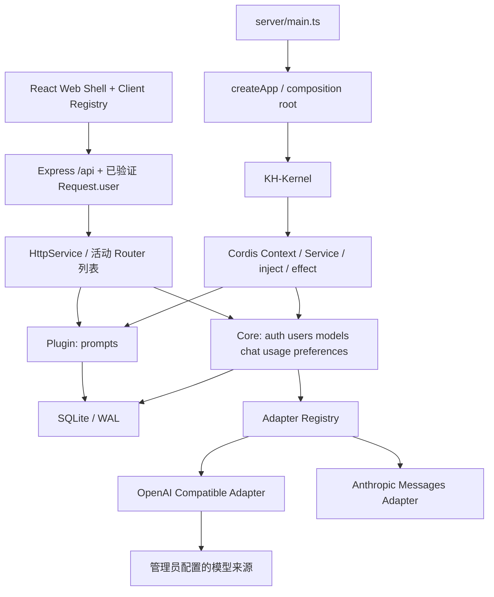

# KH-Kernel 架构

本文描述当前实现与需要保留的边界。入门阅读顺序见 [开发指南](DEVELOPMENT.md)，新增功能见 [FEATURES.md](FEATURES.md)，组件与视觉契约见 [UI_GUIDE.md](UI_GUIDE.md)。名称区分：Drift Space 是产品，KAKAM-Harness 是仓库，KH-Kernel 是平台层；Cordis 是被嵌入的库。

## 分层



**Cordis engine** 提供 Context、服务依赖注入和生命周期。**KH-Kernel** 管理本应用的 feature catalog、启动验证、核心能力保护、启停状态持久化。**Adapter** 隔离供应商模型协议。没有 fork 或重写 Cordis。

Cordis 固定在 `3.18.1` 稳定版；不依赖 `latest` 的候选版本。启动等待生命周期任务完成，注册失败时拒绝启动。

## 装配和运行路径

服务端入口 [`server/main.ts`](../src/server/main.ts) 读取配置并调用 `createApp(config)`。后者创建 Kernel，按 auth → users → models → chat → usage → prompts → preferences 注册，再启动 Context。Kernel 先安装 Database、HttpService、AdapterRegistry 和OpenAI 兼容与 Anthropic Messages Adapter。新增 feature 需要显式导入和 `kernel.register()`，没有目录自动发现。

每个请求先经过全局 HTTP / Origin / JSON 校验，再从 Cookie 解析 `req.user`，最后进入活动 Router。Kernel 负责装配与启停，并不是每个业务 HTTP 请求都调用一次的分发器。`HttpService.register()` 返回移除 Router 的函数；它是路由卸载能立即生效的关键。

客户端入口 [`client/main.tsx`](../src/client/main.tsx) 创建 UiProvider 和 App。App 解析 hash 路由、加载当前用户、获取服务器 feature 状态；编译期 `clientFeatures` 与运行时目录取交集，决定可见组件。UI 隐藏不代表后端已经鉴权，后端仍独立执行权限与归属校验。

| Feature ID    | kind   | 提供的能力                                        | 主要 UI 位置                   |
| ------------- | ------ | ------------------------------------------------- | ------------------------------ |
| `auth`        | core   | AuthService、邮箱注册 / 登录、账户资料、个人头像  | 登录页 / 设置中的账户设置      |
| `users`       | core   | 管理用户、角色、停用、重置与会话撤销              | 管理员设置                     |
| `models`      | core   | ModelsService、来源、白名单、模型授权、连通性测试 | 管理员设置；聊天可见已授权模型 |
| `chat`        | core   | 私有对话、后台生成、SSE 订阅与停止                | 工作区                         |
| `usage`       | core   | 真实用量记录、汇总与活动数据                      | 统计                           |
| `preferences` | core   | 明暗模式、Color Pattern、Chatbot 头像             | 通用设置                       |
| `prompts`     | plugin | 私人提示词、配色、带草稿进入对话                  | 工作区                         |

Models 的管理页受管理员限制，但已授权模型列表 API 向普通用户开放；不能把整个 models feature 的 HTTP 接口统一锁成管理员专用。Core / Plugin 是生命周期分类，`adminOnly` 是目录可见性，两者不是同一个维度。

## 关键边界

- `Context` 是共享能力，不放 `currentUser`。每个 HTTP 请求通过 HttpOnly Cookie 解析出自己的 `Request.user`；跨 feature 服务显式接收 `User` 参数。
- `models` 是白名单。探测到的供应商模型不会自动启用；管理员明确创建白名单条目。来源 `providers` 与模型 `models` 分表，授权 `model_grants` 以 `(model_id,user_id)` 为复合主键。
- `ModelsService.authorize(user, modelId)` 在每次模型调用前检查白名单、enabled 和授权。管理员也不能调用停用的模型。撤销权限对下一次请求生效，已在执行的请求可完成或由用户停止。
- 所有会话操作同时检查 `conversation.id + user.id`。管理员可管理用户及全局统计，但会话 API 不提供读取其他用户对话的旁路。
- 用量在请求开始时落库为 `streaming`，结束时记录实际 usage 和状态。取消 / 异常时保留已上报用量，未上报的 tokens 为 NULL。重启将遗留的 streaming 消息与用量标为 error。
- 图片经格式、MIME、数量、大小检查，以 data URL 随消息存入 SQLite，发送给被选择的模型来源；不通过公共静态 URL 暴露。

## 生命周期

每个服务端 feature 声明 `inject`。其 Router 用 `ctx.effect(() => ctx.http.register(router))` 注册，注册函数返回 disposer。插件停用时 Cordis 释放作用域，Router 同步从活动列表撤销。插件自己的数据不会自动删除。

服务端 `/api/features` 返回已验证用户可见的 manifest 与 enabled 状态；前端把它和编译期 client catalog 取交集生成导航、路由。Client catalog 的 placement 描述 workspace / statistics / settings 展示位置；设置容器属于 Web Shell，feature 保留各自 server/client 实现。管理员更新插件后立即刷新，其他客户端每 30 秒刷新目录。禁用后旧标签页可能短暂保留 UI，但 API 即刻不可用。

Core 和可选插件都按 feature 组织；“core”指平台启动必须具备且不允许在 UI 停用的 feature，区别于 Cordis 引擎自身。

注册与启停通过 Kernel 的 promise 链串行化，重复启用不会重复装配作用域。`settings` 保留启停状态，新插件无历史记录时启用；停用不删除数据，也不从前端 bundle 删除代码。没有沙箱隔离，只有可信的构建期模块与可释放的运行作用域。

## 安全与持久化

- 密码以随机盐 + scrypt 哈希保存。首位用户通过公开注册创建，角色判断与插入在同一 SQLite 写事务内完成，避免并发产生多位初始管理员。后续注册忽略客户端角色，强制普通用户。
- 密码只要求非空，不设置位数或字符组合策略；注册、登录、账户修改、管理员重置使用同一规则。
- 新用户提供 email / displayName / password；邮箱去掉首尾空白并转小写，以大小写无关唯一索引保证不重复，显示名称不作为身份标识。`users.email` 追加迁移允许旧账户暂为 NULL；旧 username 仅用于凭原密码绑定邮箱，不伪造地址或修改原用户 ID。更改邮箱需要当前密码并撤销其他会话，管理员变更邮箱会撤销该用户会话。
- Session 使用随机 256-bit token，数据库只保存 SHA-256 摘要；HttpOnly + SameSite=Strict Cookie，7 天过期。停用 / 改角色 / 管理员重置密码会撤销对应账户 session。
- API Key 使用 AES-256-GCM 加密，密钥从 `APP_SECRET` 派生。查询响应仅返回 `hasKey`，错误不反射上游凭据。
- 修改 API 要求 JSON 与匹配 Origin（浏览器请求）。登录限速、CSP、HTML 非执行渲染、Mermaid strict 模式作为补充。
- `providers.api_mode` 追加迁移默认 `chat-completions`。`ModelsService.adapter(apiMode)` 将 Chat Completions / Responses 路由到 OpenAI 兼容 Adapter，将 `anthropic-messages` 路由到独立 Anthropic Adapter；探测、测试和聊天必须统一使用此映射。思考字段只在非 none 时发送。`ui_preferences` 以 user_id 隔离主题和头像。
- 来源地址只允许管理员配置 HTTP(S)，默认不跟随重定向。支持内网模型是预期能力，因此没有阻止管理员选择私网地址。插件与管理员都属于可信边界，不能用它作为不可信租户任意网络访问的平台。
- SQLite WAL、外键和关键索引；涉及模型授权或聊天 / 用量的关联写入使用事务。未来扩容多实例时需迁移存储和生成锁。

### 模型顺序、来源元数据与回复用量

- `providers.platform_url` 为可空的平台链接，仅 HTTP(S) 且不含嵌入凭据。只出现在管理员 DTO，API 连接仍只使用 baseUrl / key / apiMode。更新时省略该字段保留旧值，空字符串或 null 清空。
- `models.sort_order` 为全局顺序。首次升级按旧的来源名称 / 模型名称排序初始化；后续启动不重排。新模型使用 MAX + 1 追加，列表按 sort_order、id 稳定排序。
- `PATCH /admin/models/order` 接收 `{ modelIds: string[] }`，管理员校验后在同步事务中验证为现有全部模型 ID 的无重复排列，再保存索引。列表增删造成冲突返回 409，不部分保存。停用模型可排序但不参与默认选择；普通用户过滤授权后第一项为其默认。浏览器已明确选择且仍有权限的模型继续优先。
- `usage.id = messages.id = requestId`（assistant）。读取历史时 LEFT JOIN 用量，`Message.usage` 为 `{ input, output, total } | null`；用户消息不带此字段。最终 SSE `done.message` 也带相同值，重连 snapshot 与历史一致。查询用量前仍先校验对话所有权；此关联不会让管理员读到其他用户的私人回复。
- `messages.duration_ms` 是可空非负整数，追加迁移保留旧数据为 null。聊天任务用服务器单调时钟从发起模型请求到结束计时，包含上游等待与生成；完成、失败和主动停止都持久保存。`Message.durationMs` 在 SSE done、历史与重连 snapshot 中一致，浏览器离开或幂等重试不会重置。旧消息及异常进程退出前未记录的用时不推算。
- Anthropic 原生头为 x-api-key / anthropic-version，图片转为 base64 内容块；只向聊天正文转发 text_delta，忽略 thinking/signature 内容。message_start 与 message_delta 的 usage 按字段合并，输出为累计计数。输入加上 cache creation / cache read，message_stop 才代表协议结束；缺失结束、error、max_tokens 等保留已生成文本并报告未完成。None 不发送思考字段；非 None 使用 adaptive + output_config.effort，兼容范围和输出上限见 README。

### 数据归属

| 数据                           | 当前持久化位置                                 | 边界                                                           |
| ------------------------------ | ---------------------------------------------- | -------------------------------------------------------------- |
| 账户 / 头像 / 会话             | `users`、`sessions`                            | 会话只存 token 摘要，客户端持有原 token                        |
| 来源 / 模型 / 授权             | `providers`、`models`、`model_grants`          | API Key 密文的解密依赖 `.env` 中的 APP_SECRET                  |
| 对话 / 消息 / 图片             | `conversations`、`messages`                    | 图片随消息保存在数据库，访问检查用户归属                       |
| 用量                           | `usage`                                        | 用户查看自己，管理员查看全局；没有真实 usage 就保留 NULL       |
| 插件启停 / 提示词              | `settings`、`prompts`                          | 停用保留数据，重启恢复启停状态                                 |
| 明暗模式 / 色系 / Chatbot 头像 | `ui_preferences`                               | 以 user_id 隔离；浏览器有外观缓存，服务器是账户持久化来源      |
| 字号                           | localStorage `drift:font-size:<userId>`        | 按账户和当前浏览器保存，不随服务器备份迁移                     |
| 最近模型 / 思考程度            | `kh:model` / `drift:effort:<userId>:<modelId>` | 最近模型是浏览器级偏好，实际使用仍受用户模型列表和后端授权约束 |

表结构和追加迁移集中在 [`kernel/database.ts`](../src/kernel/database.ts)。当前数据库事务回调同步执行，不能把 async 函数 / await 放入其中；网络 I/O 应在事务外完成。未来改变持久化格式时要兼容已有数据，具体扩展步骤见功能指南。

`PUBLIC_ORIGIN` 目前只接受一个来源，比较浏览器发送的 Origin。`COOKIE_SECURE` 控制会话 Cookie 的 HTTPS 限制；`TRUST_PROXY` 控制 Express 对代理的信任，不是绕过 Origin 校验的开关。部署配置、数据库和密钥的备份规则见 [README](../README.md#备份与重新构建)。

## 取舍

第一版优先支持个人部署的闭环，未引入工作区租户、跨机器事件总线、沙箱或通用任务编排。之后接入 RAG、Memory 等能力时应增加稳定服务契约或扩展点；不要让基础聊天强依赖某个可选插件。

参考：[Cordis 官方仓库](https://github.com/cordiverse/cordis)。本仓库的实际行为以锁定版本、实现和集成测试为准。

## 界面偏好

界面偏好由 preferences feature 保存到用户独立的 `ui_preferences`。v0.6 的追加迁移新增 `color_pattern`，从旧 `accent_color` 推导所属色系；后者仅保留旧客户端兼容。Web Shell 使用独立的 `shellTokens(mode)`：纯黑白灰的表面、文字与控件，不受色系切换影响。`conversations.color_slot`、`prompts.color_slot` 以可空整数保存手动选色，null 代表稳定自动配色；更新 API 校验范围和资源所有权。切换色系以序号映射，短色板按模数折返，不删除历史选择。

代码语法颜色独立存放在 `syntax-highlighting.css`，按相同的语义 token 集合分别提供明暗色板（基于 highlight.js GitHub 主题），仅作用于 Markdown 代码块。不要用 Shell 文字色覆盖 `.hljs-*`；浏览器回归测试会在不重建消息 DOM 的情况下切换系统主题，检查 Python 关键字、函数名、数字、字符串、内置函数、注释的区分与可读性。

个人头像由 auth feature 的 `PATCH /auth/avatar` 管理，服务端只更新当前会话账户。`users.avatar` 追加可空列，统一 User 响应包含头像；客户端居中裁剪为最长 512 px 的方形栅格，服务端再次校验图片签名与 512 KB 上限，不接受 SVG、外链或目标用户 ID。通用 `UserAvatar` 在加载失败时回退到姓名首字。

色系注册接口可配置 `tint.light` / `tint.dark` 的 fill、soft、line 不透明度，统一映射组件底色、淡底色和边框；仍保留次要文字对比度保护。

## 实时输入

聊天 feature 内的 Tiptap 编辑器持有富文本树，只有外部草稿变更才重载内容；编辑时使用事务保留光标、选择和撤销历史。粘贴 Markdown 会解析为文档，发送仍保存 Markdown，沿用服务端消息契约。公式通过 KaTeX 节点显示并提供编辑弹窗，代码块保留可编辑源码及 Mermaid / LaTeX 预览。中文输入法合成期间 Enter 不触发发送。

模型与思考程度由聊天 feature 的 `ModelPicker` 统一提供，原生 Popover 进入顶层以避免被聊天容器裁切，随窗口 / 可视视口调整位置。模型列表可搜索，五档滑块保留键盘操作；选择仍由 ChatPage 保存并写入原消息请求协议，None 继续省略上游思考字段。

## 生成任务与浏览器订阅

`POST /conversations/:id/messages` 事务保存用户消息、streaming 回复和用量记录后返回 202，后台任务持有上游请求的 AbortController。提交 UUID 同时作为回复 ID，重试相同提交仅返回原任务，防止重复调用。

`GET /conversations/:id/events` 是可替换的 SSE 订阅：先发送完整 snapshot，再发送带 messageId 的 delta 和最终 done。活动任务保留最新文本并每 1.5 秒写入检查点，结束时提交完整回复与用量。订阅断开仅清理监听器和心跳，不中止上游。所有订阅、查询和停止操作均校验会话归属。

前端在可见性恢复、focus、pageshow 或 online 时重新订阅；连接错误时退避重试。snapshot 替换本地消息，避免重连重复追加文字。客户端卸载、隐藏或离线仅销毁订阅，不发送停止请求；`POST /conversations/:id/stop` 才显式取消当前生成。

KH-Kernel 的 shutdown hook 在 Cordis 关闭数据库前取消并等待活动任务保存结束状态。异常重启则将遗留 streaming 记录标记 error。该实现不跨进程恢复上游生成，保留单进程、每用户一个活动任务和 180 秒超时的限制。

## 字号与聊天阅读位置

字体大小属于当前设备的账户偏好，独立于服务端 `UiPreferences`。Web Shell 的 UiProvider 在账户切换时加载 `drift:font-size:<userId>`，退出时恢复默认，并同步同设备标签页的 storage 事件。`typography.css` 用固定 rem 根字号定义语义字号和统一缩放系数，组件引用变量；正文、输入、控件、代码、辅助说明与标题保留层级。设备未允许存储时仍即时应用，并在设置页提示无法持久保存。

聊天 feature 使用独立的 `.chat-history` 滚动容器，输入框在其下方自然占位。阅读位置 hook 区分底部跟随、用户上翻及问题跳转，ResizeObserver 覆盖流式增长、图片 / 图表异步排版及字号导致的高度变化。订阅更新保留现有历史，避免加载状态清空 DOM 导致位置跳动。大纲使用消息 ID 定位，内容作为纯文本摘要呈现，不插入模型生成的 HTML。

## Color Pattern 扩展接口

共享模块 `src/shared/appearance.ts` 定义 `ColorPattern`、`ColorAssignment` 与 `ColorPatternRegistry`。只在这个注册表添加色系，前端标签页、选色器和后端校验就能同时识别：

```ts
colorPatterns.register({
  id: 'coast',
  name: '海岸',
  description: '海水与沙滩的颜色',
  colors: [
    { id: 'sea', name: '海蓝', original: 'Sea', color: '#427b98' },
    { id: 'sand', name: '沙金', original: 'Sand', color: '#c7aa7e' },
  ],
});
```

Registry 校验唯一 ID、1–64 色、合法六位十六进制值；每个色系可以拥有不同长度。`resolve(patternId, mode, { key, slot?, index? })` 将色板映射为原色、组件背景、柔和背景、边框和中性文字 CSS token，并调节背景混色保证辅助文字达到 4.5:1 对比度。`slot` 为手动序号；省略时由稳定 key 和 index 分配。不得在 render 中使用 Math.random，以免刷新、流式更新时跳色。

Feature 的 React client 使用公共 hook 和样式：

```tsx
const colors = usePatternColors();
<article
  className="panel pattern-card"
  style={colors.style({ key: item.id, slot: item.colorSlot })}
>
  <h3>{item.title}</h3>
</article>;
```

对话、提示词库、首页建议、统计卡片和活动图均复用映射。文本始终继承 Shell 的中性文字，原色色值用于边框、图标、色样与数据可视化。`ColorPickerButton` 提供共用选择弹窗，持久化由各 feature 的授权 API 完成。主题和色系随账户保存，字号继续保持设备独立。
